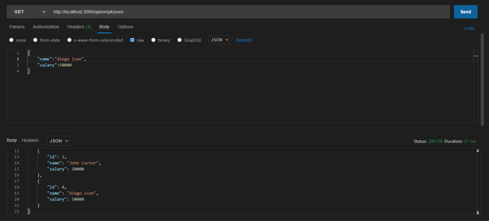
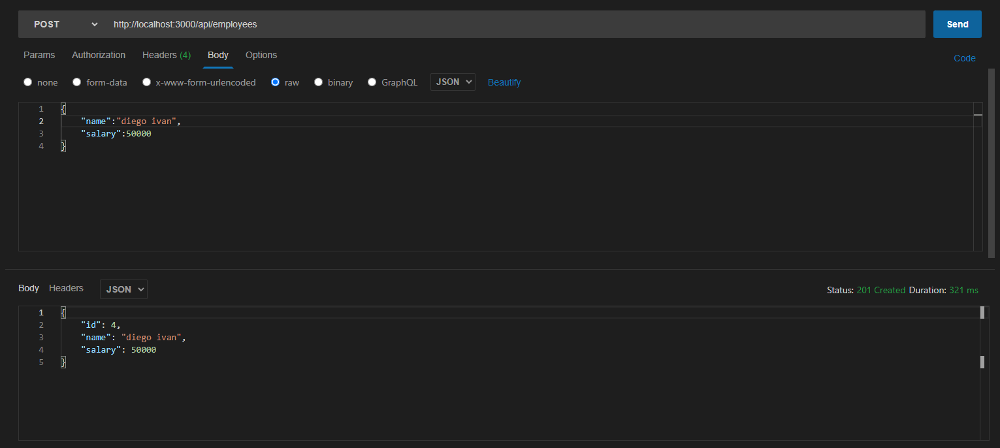
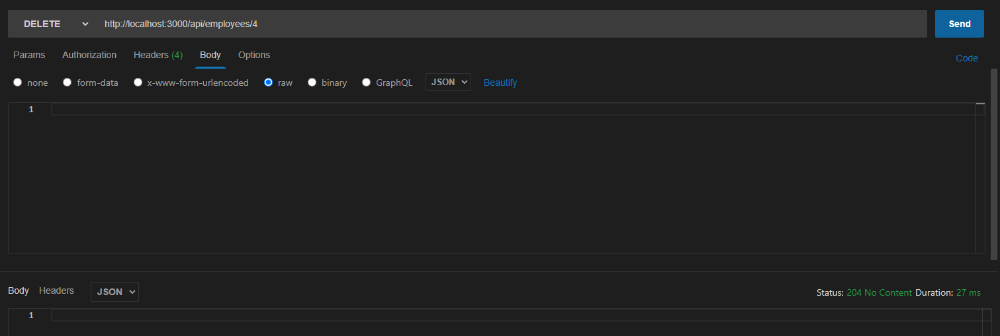
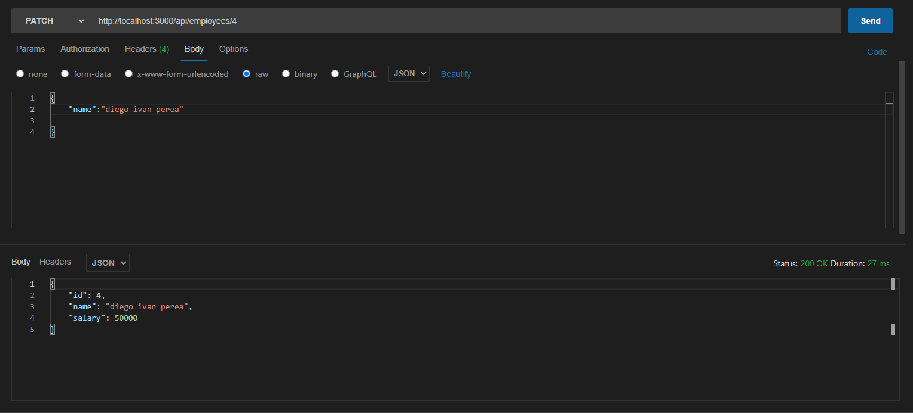
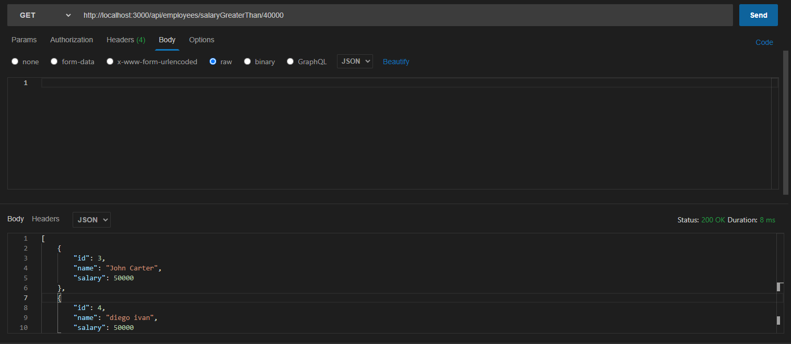

# Nodejs MYSQL query REST API

<p align="justify">
Nodejs MYSQL REST API query of a company of employee name and salary
</p>

GET
<p align="center">
  
</p>
POST
<p align="center">
  
</p>


DELETE

<p align="center">
  
</p>


PATCH 
<p align="center">
  
</p>


FILTER GET
<p align="center">
  
</p>


Inspiration from [Fazt Code](https://github.com/fazt/nodejs-mysql-restapi)

## Steps to implement

1. Use Dockercompose
```
docker-compose up
```
2. For get node_modules use 

```python
npm install
#run
npm run dev
```

To enter the docker container
```
docker exec -it companydb bash
mysql -u root -p
use companydb;
```